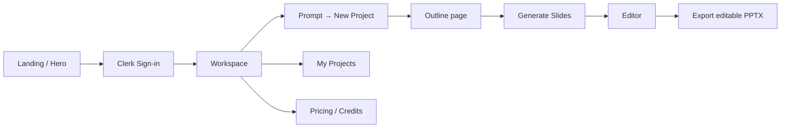

# PPT Slider

> AI-powered presentation builder — describe a topic, generate an outline, refine slides, and export a real editable PowerPoint.

[](https://react.dev)
[](https://vite.dev)
[](https://www.typescriptlang.org/)
[](https://firebase.google.com/)
[](https://clerk.com/)
[](https://tailwindcss.com/)

---

## Table of contents

- [What it does](#what-it-does)
- [Quick start](#quick-start)
- [Environment variables](#environment-variables)
- [App flow](#app-flow)
- [Features we built](#features-we-built)
- [Routes](#routes)
- [Tech stack & libraries](#tech-stack--libraries)
- [Project structure](#project-structure)
- [Scripts](#scripts)
- [Notes for contributors](#notes-for-contributors)

---

## What it does

PPT Slider turns a short prompt into a full presentation workflow:

1. **Sign in** with Clerk
2. **Create a project** from a natural-language prompt
3. **Generate & edit an outline** with Gemini (Firebase AI Logic)
4. **Generate HTML slides**, edit them in the canvas
5. **Keep outline ↔ slides in sync** as either side changes
6. **Export editable `.pptx`** (not just screenshots)
7. **Manage credits & pricing** via Clerk Billing

---

## Quick start

<details open>
<summary><strong>1. Clone & install</strong></summary>

```bash
git clone <your-repo-url>
cd ppt-slider
npm install
```

</details>

<details open>
<summary><strong>2. Create a local <code>.env</code></strong></summary>

Copy the keys below into a `.env` file in the project root.  
**Never commit `.env`** — it is listed in `.gitignore`.

```env
VITE_CLERK_PUBLISHABLE_KEY=
VITE_FIREBASE_API_KEY=
VITE_APPCHECK_DEBUG_TOKEN=
# VITE_RECAPTCHA_SITE_KEY=   # production only
```

See [Environment variables](#environment-variables) for what each key is for.

</details>

<details open>
<summary><strong>3. Run the app</strong></summary>

```bash
npm run dev
```

Open the URL Vite prints (usually `http://localhost:5173`).

</details>

---

## Environment variables

| Variable | Required | Used for |
|---|---|---|
| `VITE_CLERK_PUBLISHABLE_KEY` | Yes | Clerk auth + pricing UI |
| `VITE_FIREBASE_API_KEY` | Yes | Firestore + Firebase AI (Gemini) |
| `VITE_APPCHECK_DEBUG_TOKEN` | Local yes | App Check debug token (UUID from Firebase Console → App Check → Manage debug tokens) |
| `VITE_RECAPTCHA_SITE_KEY` | Production | reCAPTCHA v3 site key for App Check in production |

> **Tip:** Do **not** put an App Check debug token in `VITE_RECAPTCHA_SITE_KEY`. That slot must be a real reCAPTCHA key (`6L...`).

---

## App flow



| Step | Where | What happens |
|---|---|---|
| Landing | `/` | Header + Hero marketing surface |
| Workspace | `/workspace` | Prompt box, project list, user bootstrap in Firestore |
| Outline | `/workspace/project/:id/outline` | AI outline gen/edit, credit checks, sync to Firestore |
| Editor | `/workspace/project/:id/editor` | Slide canvas, style tools, outline ↔ slide sync, PPT export |
| Pricing | `/workspace/pricing` | Clerk `PricingTable` (forced light theme) |

---

## Features we built

<details open>
<summary><strong>Auth, users & billing</strong></summary>

- [x] Clerk authentication (`@clerk/react`)
- [x] Auto-create Firestore `users` docs on first login (seed credits)
- [x] `UserDetailContext` for credits / profile across the app
- [x] Credit limit dialog when generation is blocked
- [x] Pricing page with Clerk Billing `PricingTable`

</details>

<details open>
<summary><strong>AI presentation pipeline</strong></summary>

- [x] Firebase AI Logic + Gemini (`gemini-3.5-flash`, with quieter fallbacks)
- [x] Firebase App Check (debug token locally, reCAPTCHA in production)
- [x] Resilient generate / stream helpers with retry & model fallback
- [x] Prompt → project → AI outline generation
- [x] Outline editing (dialog + persistence to Firestore)
- [x] Generate slides from outline → navigate to editor
- [x] Skeleton vs outline list exclusivity while streaming

</details>

<details open>
<summary><strong>Editor & sync</strong></summary>

- [x] Slide canvas with Style / floating tools
- [x] Outline edits regenerate the matching slide
- [x] Slide edits update the left outline
- [x] Stale HTML cleared when outline changes so the editor regenerates cleanly
- [x] `isSlidesGenerated` flag + slide persistence in Firestore

</details>

<details open>
<summary><strong>Export</strong></summary>

- [x] Editable PowerPoint export via `dom-to-pptx`
- [x] Local Flowbite pattern assets under `public/flowbite-patterns/` (avoids CORS on S3 demo assets)
- [x] URL rewriting so backgrounds/images survive export

</details>

<details>
<summary><strong>UI / DX polish</strong></summary>

- [x] shadcn/ui component system + Tailwind CSS v4
- [x] Motion / carousel / toasts for workspace UX
- [x] My Projects list (safe empty-state init)
- [x] Pricing table forced into light appearance for readability

</details>

---

## Routes

| Path | Screen |
|---|---|
| `/` | Landing (`Header` + `Hero`) |
| `/workspace` | Dashboard: prompt + projects |
| `/workspace/project/:projectId/outline` | Outline editor |
| `/workspace/project/:projectId/editor` | Slide editor |
| `/workspace/pricing` | Plans & billing |

---

## Tech stack & libraries

### Core

| Library | Role |
|---|---|
| [React 19](https://react.dev) | UI |
| [TypeScript](https://www.typescriptlang.org/) | Types |
| [Vite 8](https://vite.dev) | Dev server & build |
| [React Router DOM 7](https://reactrouter.com/) | Client routing |

### Backend / AI / Auth

| Library | Role |
|---|---|
| [Firebase](https://firebase.google.com/) (`firebase`) | Firestore persistence |
| Firebase AI Logic | Gemini outline & slide generation |
| Firebase App Check | Protects AI endpoints |
| [Clerk React](https://clerk.com/) (`@clerk/react`) | Auth + billing |

### Styling & UI

| Library | Role |
|---|---|
| [Tailwind CSS 4](https://tailwindcss.com/) + `@tailwindcss/vite` | Styling |
| [shadcn/ui](https://ui.shadcn.com/) (`shadcn`, `@base-ui/react`, CVA, `clsx`, `tailwind-merge`) | Accessible component primitives |
| [Lucide React](https://lucide.dev/) | Icons |
| [Geist Variable](https://fontsource.org/) (`@fontsource-variable/geist`) | Typography |
| [Motion](https://motion.dev/) (`motion`) | Animations |
| [Sonner](https://sonner.emilkowal.ski/) | Toasts |
| [next-themes](https://github.com/pacocoursey/next-themes) | Theme plumbing |
| [tw-animate-css](https://www.npmjs.com/package/tw-animate-css) | Animation utilities |

### Presentation / export

| Library | Role |
|---|---|
| [dom-to-pptx](https://www.npmjs.com/package/dom-to-pptx) | DOM → editable PPTX export |
| [pptxgenjs](https://gitbrent.github.io/PptxGenJS/) | PPTX utilities |
| Local `public/flowbite-patterns/` | CORS-safe pattern / image assets for slides |

### Supporting UI packages

| Library | Role |
|---|---|
| `embla-carousel-react` | Carousels |
| `cmdk` | Command palette |
| `input-otp` | OTP inputs |
| `react-day-picker` / `date-fns` / `moment` | Dates |
| `react-resizable-panels` | Resizable layout panels |
| `recharts` | Charts (shadcn chart UI) |
| `uuid` | IDs |

### Dev tooling

| Library | Role |
|---|---|
| ESLint + `typescript-eslint` | Lint |
| `@vitejs/plugin-react` | React Fast Refresh |
| `@types/react` / `@types/node` | Type defs |

---

## Project structure

```text
ppt-slider/
├── config/
│   └── FirebaseConfig.ts      # Firebase, App Check, Gemini helpers
├── context/
│   └── UserDetailContext.tsx  # Credits / user profile
├── public/
│   └── flowbite-patterns/     # Local slide assets (CORS-safe)
├── src/
│   ├── components/
│   │   ├── custom/            # App screens & widgets (Hero, PromptBox, Editor tools…)
│   │   └── ui/                # shadcn primitives
│   ├── lib/
│   │   └── exportEditablePptx.ts
│   ├── workspace/
│   │   ├── index.tsx          # Workspace shell
│   │   ├── pricing/
│   │   └── project/
│   │       ├── outline/
│   │       └── editor/
│   ├── App.tsx                # Landing
│   └── main.tsx               # Clerk + Router + providers
├── .env                       # Local secrets (gitignored)
└── package.json
```

<details>
<summary><strong>Key custom components</strong></summary>

| File | Purpose |
|---|---|
| `Header.tsx` | Nav / auth entry |
| `Hero.tsx` | Landing hero |
| `PromptBox.tsx` | Create project from prompt |
| `MyProjects.tsx` | Project list |
| `OutlineSection.tsx` / `EditOutlineDialog.tsx` | Outline UX |
| `SliderFrame.tsx` / `SliderStyle.tsx` | Slide canvas & styles |
| `FloatingActionTool.tsx` | Editor floating controls |
| `CreditLimitDialog.tsx` | Soft paywall when credits run out |

</details>

---

## Scripts

| Command | What it does |
|---|---|
| `npm run dev` | Start Vite dev server |
| `npm run build` | Typecheck + production build |
| `npm run preview` | Preview the production build |
| `npm run lint` | Run ESLint |

---

## Notes for contributors

- **Secrets:** keep `.env` local. If it was ever pushed, rotate Clerk / Firebase / App Check keys.
- **App Check:** register a debug token for localhost, or Gemini calls will 401.
- **Stale Vite deps:** if you see a `504` out of `/node_modules/.vite`, clear the cache and restart with `--force`:

  ```bash
  rm -rf node_modules/.vite
  npx vite --force
  ```

- **Export:** prefer `dom-to-pptx` path in `src/lib/exportEditablePptx.ts` — it produces editable slides, not flat screenshots.

---

<p align="center">
  Built with React · Vite · Firebase · Clerk · Gemini
</p>
